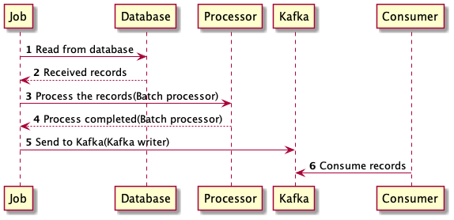

# Spring Batch Kafka Writer
The following code example, is showing that we can use spring batch to read from database, process the job and write to Kafka.
Spring Batch is useful for large batch process transaction such as payroll, schedule, statements of record,etc.
## Requirements
* Kafka installation. You can download apache kafka or docker-compose setup.
* Java 11 or higher
* Spring Data JPA, RestController
## Spring Batch Flow

